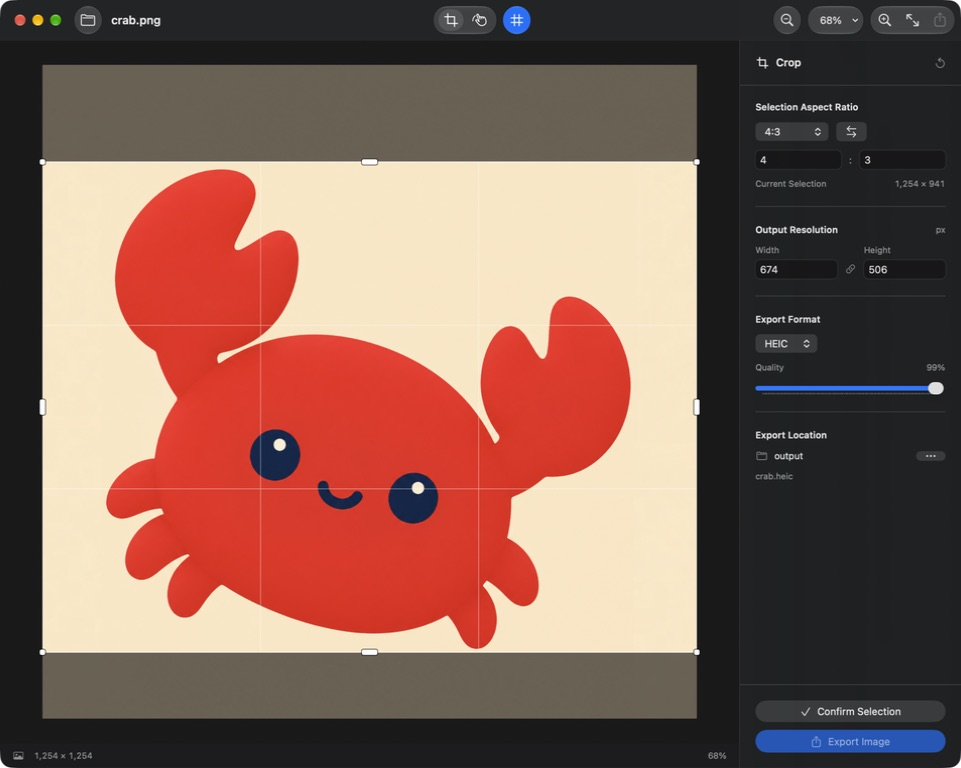

# RatioCrop

A native macOS image cropping app built with SwiftUI, MVVM, and `@Observable`. Requires macOS 14.6 or later, uses Swift 6, and has no third-party dependencies.



## Source of Truth

- `SourceImage.pixels` holds the full-resolution original image with EXIF orientation applied. It remains unchanged throughout editing.
- `EditorViewModel.selection` stores the crop rectangle in original-image pixels, measured from the top-left corner, independently of canvas zoom and pan.
- `confirmedCrop` stores the confirmed selection. The preview is derived data; exports always sample the original image.
- `EditorSettings` is the single source of truth for the aspect ratio, the last edited output dimension and its value, export format, quality, grid visibility, and directory bookmark. Changes are saved to UserDefaults. The other output dimension is calculated on demand rather than stored separately.
- Canvas zoom and pan affect only the display. Opening a new image resets the selection, confirmation state, viewport, and undo history while preserving settings.

SwiftUI manages the window, toolbar, inspector, and menus. A native canvas hosted in `NSViewRepresentable` handles mouse and trackpad input, cursors, and pixel rendering. Image decoding, resampling, encoding, and file writing run off the main thread via `@concurrent`. Importing another image cancels outdated import tasks. Export captures an independent snapshot, so you can open the next image while an export is in progress.

## Usage

1. Drag an image into the window or press `⌘O` to open one.
2. Choose 1:1, 16:9, 4:3, 3:2, or 4:5, or enter a custom aspect ratio. Use the swap button to switch between landscape and portrait.
3. Drag inside the selection to move it, drag its corners or edges to resize it, or drag outside it to draw a new selection. The selection stays within the image and maintains the chosen aspect ratio.
4. Set the output width or height. The other dimension is calculated automatically and rounded to the nearest whole pixel.
5. Click **Confirm Selection** or press `⌘K` to preview the crop, then export it. You can return to editing or undo the change.

Pinch the trackpad or hold `⌘` while scrolling to zoom. Scroll, use the pan tool, or hold Space while dragging to pan. A two-finger smart zoom gesture toggles between actual size and fit to window. Arrow keys move the selection by 1 pixel; Shift + arrow keys move it by 10 pixels.

| Shortcut | Action |
| --- | --- |
| `⌘O` | Open an image |
| `⌘K` | Confirm selection |
| `⇧⌘E` | Export |
| `⌘Z` / `⇧⌘Z` | Undo / redo |
| `⌘+` / `⌘-` | Zoom in / out |
| `⌘0` / `⌘1` | Fit to window / actual size |
| Escape | Return from the crop preview to editing |

## Export

Supported formats are JPEG, PNG, AVIF, HEIC, and TIFF. Encoder availability depends on the system's ImageIO capabilities; unavailable formats are disabled. JPEG, AVIF, and HEIC offer a quality slider. JPEG fills transparent areas with white, while PNG preserves transparency. Exports use sRGB and strip source metadata, including EXIF and GPS data.

At 100% AVIF quality, the encoder receives a value of 0.99 because the system encoder rejects 1.0. The displayed and saved quality setting remains unchanged, and this option does not guarantee lossless encoding. JPEG and HEIC still use 1.0 at 100% quality.

Choose an output folder on the first export. Subsequent exports write directly to that authorized folder, with access persisted through a security-scoped bookmark. Output files keep the original filename stem and use the extension for the selected format. Replacing an existing output requires confirmation; overwriting the original image at its source path is blocked. Files are written using atomic replacement.

Imports are limited to 100 million pixels and 32,768 pixels per side. Exports are limited to 100 million pixels and 16,384 pixels per side. For multi-frame images, only the first frame is imported, and exports are static images. Custom aspect-ratio components accept decimal values from 1 to 1,000.

## Build and Validation

Open `ImageAspectCropper.xcodeproj` in Xcode, select the `ImageAspectCropper` scheme, and run the app. The project includes a Swift Testing target covering crop geometry, linked output dimensions, settings restoration, image replacement, undo and redo, EXIF orientation, transparency, and actual encoding and decoding for all five export formats.

Build from the command line:

```sh
xcodebuild -project ImageAspectCropper.xcodeproj -scheme ImageAspectCropper -destination 'platform=macOS' build
```

To run the test suite explicitly:

```sh
xcodebuild -project ImageAspectCropper.xcodeproj -scheme ImageAspectCropper -destination 'platform=macOS' test
```

The layout takes inspiration from the crop tools in [Lightroom](https://helpx.adobe.com/ie/lightroom/desktop/edit-photos/crop-rotate-geometry.html) and [Photomator](https://support.pixelmator.com/photomator-user-guide/crop-tool/crop-flip-and-rotate-photos): a central canvas, a right-hand inspector, frequently used tools at the top, and an aspect-locked selection with a composition grid.
